# tokokita

Nama    : Rassya Hafizh Suharjo

NIM     : H1D022068

Shift Baru : A

Shift Lama : D

## screenshot dan penjelasan serta kode

### Registrasi
1. Tampilan page registrasi = registrasi_page.dart
Page registrasi terdiri atas 3 texteditingcontroller yang kemudian dibuat menjadi 4 textfield untuk memasukkan nilai dan 1 elevatedbutton untuk tombol submit.
``` dart
final _formKey = GlobalKey<FormState>();
  bool _isLoading = false;
  final _namaTextboxController = TextEditingController();
  final _emailTextboxController = TextEditingController();
  final _passwordTextboxController = TextEditingController();

body: SingleChildScrollView(
        child: Padding(
          padding: const EdgeInsets.all(8.0),
          child: Form(
            key: _formKey,
            child: Column(
              mainAxisAlignment: MainAxisAlignment.center,
              children: [
                _namaTextField(),
                _emailTextField(),
                _passwordTextField(),
                _passwordKonfirmasiTextField(),
                _buttonRegistrasi()
```
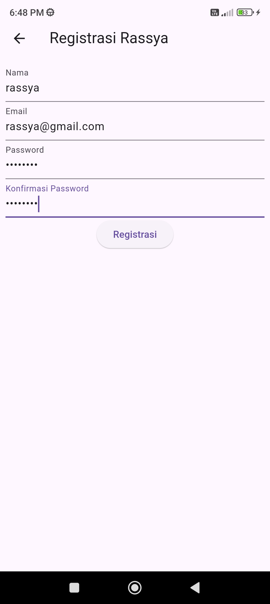

2. Registrasi berhasil dan gagal = registrasi_page.dart -> registrasi_bloc.dart
Jika memasukkan value ke TextField dan menekan registrasi, maka widget buttonRegistrasi akan memanggil method submit yang mengirimkan value nama, email, dan password ke registrasi_bloc.dart. jika registrasi berhasil maka akan memanggil showdialog SuccesDialog, sedangkan bila error/gagal akan memanggil WarningDialog
``` dart
Widget _buttonRegistrasi() {
    return ElevatedButton(
        child: const Text("Registrasi"),
        onPressed: () {
          var validate = _formKey.currentState!.validate();
          if (validate) {
            if (!_isLoading) _submit();
          }
        });
  }

  void _submit() {
    _formKey.currentState!.save();
    setState(() {
      _isLoading = true;
    });
    RegistrasiBloc.registrasi(
            nama: _namaTextboxController.text,
            email: _emailTextboxController.text,
            password: _passwordTextboxController.text)
        .then((value) {
      showDialog(
          context: context,
          barrierDismissible: false,
          builder: (BuildContext context) => SuccessDialog(
                description: "Registrasi berhasil, silahkan login",
                okClick: () {
                  Navigator.pop(context);
                },
              ));
    }, onError: (error) {
      showDialog(
          context: context,
          barrierDismissible: false,
          builder: (BuildContext context) => const WarningDialog(
                description: "Registrasi gagal, silahkan coba lagi",
              ));
    });
    setState(() {
      _isLoading = false;
    });
  }
```

kemudian pada registrasi_bloc.dart data dikirimkan ke restful api menggunakan var apiUrl pada api_url.dart sehingga bisa masuk ke database.
``` dart
class RegistrasiBloc {
  static Future<Registrasi> registrasi(
      {String? nama, String? email, String? password}) async {
    String apiUrl = ApiUrl.registrasi;
    var body = {"nama": nama, "email": email, "password": password};
    var response = await Api().post(apiUrl, body);
    var jsonObj = json.decode(response.body);
    return Registrasi.fromJson(jsonObj);
  }
}
```

``` dart
class ApiUrl {
  static const String baseUrl = 'http://10.99.4.182:8080'; //diganti lagi ke yg pdf ga pake punya sendiri wkwkwk
  static const String registrasi = baseUrl + '/registrasi';
```
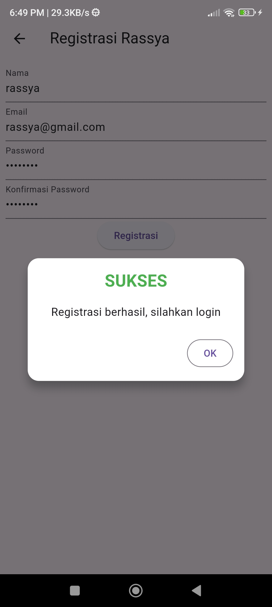
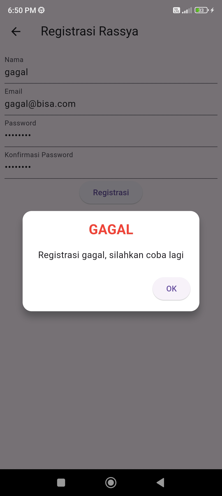


### Login
1. Halaman login = login_page.dart
pada halaman login terdapat 2 TextField dan 1 Button untuk login serta sebuah widget yang mengarahkan ke halaman registrasi.
```dart
class _LoginPageState extends State<LoginPage> {
  final _formKey = GlobalKey<FormState>();
  bool _isLoading = false;
  final _emailTextboxController = TextEditingController();
  final _passwordTextboxController = TextEditingController();

  @override
  Widget build(BuildContext context) {
    return Scaffold(
      appBar: AppBar(
        title: const Text('Login Rassya'),
      ),
      body: SingleChildScrollView(
        child: Padding(
          padding: const EdgeInsets.all(8.0),
          child: Form(
            key: _formKey,
            child: Column(
              children: [
                _emailTextField(),
                _passwordTextField(),
                _buttonLogin(),
                const SizedBox(
                  height: 30,
                ),
                _menuRegistrasi()
```
2. Login berhasil dan Gagal = login_page->login_bloc.dart
Jika menekan button untuk login maka akan memanggil method submit yang didalamnya mengambil nilai inputan dari TextField yang ada dan mengirimkan ke logi_bloc.dart. Jika berhasil terkirim dan sesuai database maka akan langsung diarahkan ke page List Produk, sedangkan bila gagal atau error maka akan menampilkan popup ShowDialog berupa WarningDialog.
```dart
Widget _buttonLogin() {
    return ElevatedButton(
        child: const Text("Login"),
        onPressed: () {
          var validate = _formKey.currentState!.validate();
          if (validate) {
            if (!_isLoading) _submit();
          }
        });
  }

  void _submit() {
    _formKey.currentState!.save();
    setState(() {
      _isLoading = true;
    });
    LoginBloc.login(
            email: _emailTextboxController.text,
            password: _passwordTextboxController.text)
        .then((value) async {
      if (value.code == 200) {
        await UserInfo().setToken(value.token.toString());
        await UserInfo().setUserID(int.parse(value.userID.toString()));
        Navigator.pushReplacement(context,
            MaterialPageRoute(builder: (context) => const ProdukPage()));
      } else {
        showDialog(
            context: context,
            barrierDismissible: false,
            builder: (BuildContext context) => const WarningDialog(
                  description: "Login gagal, silahkan coba lagi",
                ));
      }
    }, onError: (error) {
      print(error);
      showDialog(
          context: context,
          barrierDismissible: false,
          builder: (BuildContext context) => const WarningDialog(
                description: "Login gagal, silahkan coba lagi",
              ));
    });
    setState(() {
      _isLoading = false;
    });
  }
```

di login_bloc.dart data dikirim ke api dan dicocokkan dengan database.
```dart
class LoginBloc {
  static Future<Login> login({String? email, String? password}) async {
    String apiUrl = ApiUrl.login;
    var body = {"email": email, "password": password};
    var response = await Api().post(apiUrl, body);
    var jsonObj = json.decode(response.body);
    return Login.fromJson(jsonObj);
  }
}
```
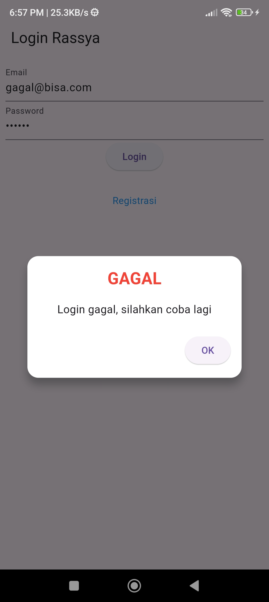

### Produk
1. List Produk = produk_bloc.dart->produk_page.dart
Pada 'produk_page.dart' terdapat sebuah getter bernama 'GetProduks' yang mengambil nilai yang diambil oleh 'produk_bloc.dart' dari database mebggunakan api.
produk_page
```dart
body: FutureBuilder<List>(
        future: ProdukBloc.getProduks(),
        builder: (context, snapshot) {
          if (snapshot.hasError) print(snapshot.error);
          return snapshot.hasData
              ? ListProduk(
                  list: snapshot.data,
                )
              : const Center(
                  child: CircularProgressIndicator(),
                );
        },
      ),
```

produk_bloc
```dart
static Future<List<Produk>> getProduks() async {
    String apiUrl = ApiUrl.listProduk;
    var response = await Api().get(apiUrl);
    var jsonObj = json.decode(response.body);
    List<dynamic> listProduk = (jsonObj as Map<String, dynamic>)['data'];
    List<Produk> produks = [];
    for (int i = 0; i < listProduk.length; i++) {
      produks.add(Produk.fromJson(listProduk[i]));
    }
    return produks;
  }
```
Hasil value database yang diambil kemudian dicek oleh itemcount. Apabila != 0 dan >1, maka akan menampilkan widget card yang berisi list produk dan harganya. Dan dari card tersebut bila dipencet akan dinavigasi ke halaman detail produk.
```dart
Widget build(BuildContext context) {
    return ListView.builder(
        itemCount: list == null ? 0 : list!.length,
        itemBuilder: (context, i) {
          return ItemProduk(
            produk: list![i],
          );
        });
  }
```

```dart
Widget build(BuildContext context) {
    return GestureDetector(
      onTap: () {
        Navigator.push(
            context,
            MaterialPageRoute(
                builder: (context) => ProdukDetail(
                      produk: produk,
                    )));
      },
      child: Card(
        child: ListTile(
          title: Text(produk.namaProduk!),
          subtitle: Text(produk.hargaProduk.toString()),
        ),
      ),
    );
  }
```
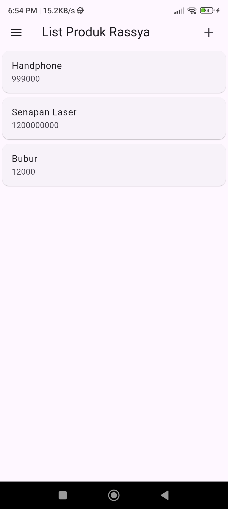
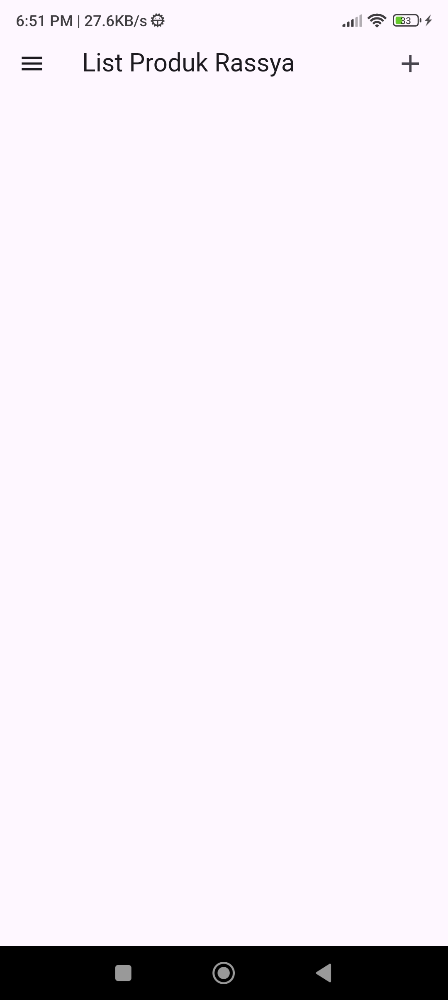

### Tambah Produk
1. Tambah Produk = produk_form.dart->produk_bloc.dart
Halaman Tambah produk merupakan hasil percabangan dari produk_form.dart apabila widget tidak membawa value.
```dart
isUpdate() {
    if (widget.produk != null) {
      setState(() {
        judul = "UBAH PRODUK Rassya";
        tombolSubmit = "UBAH";
        _kodeProdukTextboxController.text = widget.produk!.kodeProduk!;
        _namaProdukTextboxController.text = widget.produk!.namaProduk!;
        _hargaProdukTextboxController.text = widget.produk!.hargaProduk.toString();
      });
    } else {
      judul = "TAMBAH PRODUK Rassya";
      tombolSubmit = "SIMPAN";
    }
  }
```
Halaman tambah produk terdiri atas 3 textfield dan 1 button.
```dart
Widget build(BuildContext context) {
    return Scaffold(
      appBar: AppBar(title: Text(judul)),
      body: SingleChildScrollView(
        child: Padding(
          padding: const EdgeInsets.all(8.0),
          child: Form(
            key: _formKey,
            child: Column(
              children: [
                _kodeProdukTextField(),
                _namaProdukTextField(),
                _hargaProdukTextField(),
                _buttonSubmit()
              ],
            ),
          ),
```
Jika menekan button submit dan seperti yang kita ketahui dari widget sebelumnya tidak membawa nilai maka akan memanggil method simpan. Method simpan mengambil 3 value dari textfield dan harganya diubah ke string. kemudian dikirimkan ke produk_bloc.dart dan dikirm ke database melalui restful api dengan method addProduk. Terdapat warning dialog jika gagal terkirim ke api.
```dart
Widget _buttonSubmit() {
    return OutlinedButton(
        child: Text(tombolSubmit),
        onPressed: () {
          var validate = _formKey.currentState!.validate();
          if (validate) {
            if (!_isLoading) {
              if (widget.produk != null) {
                //kondisi update produk
                ubah();
              } else {
                //kondisi tambah produk
                simpan();
              }
            }
          }
        });
  }

  simpan() {
    setState(() {
      _isLoading = true;
    });
    Produk createProduk = Produk(id: null);
    createProduk.kodeProduk = _kodeProdukTextboxController.text;
    createProduk.namaProduk = _namaProdukTextboxController.text;
    createProduk.hargaProduk = int.parse(_hargaProdukTextboxController.text);
    ProdukBloc.addProduk(produk: createProduk).then((value) {
      Navigator.of(context).push(MaterialPageRoute(
          builder: (BuildContext context) => const ProdukPage()));
    }, onError: (error) {
      showDialog(
          context: context,
          builder: (BuildContext context) => const WarningDialog(
                description: "Simpan gagal, silahkan coba lagi",
              ));
    });
    setState(() {
      _isLoading = false;
    });
  }
```

Pengiriman data ke restful api menggunakan method addProduk
```dart
static Future addProduk({Produk? produk}) async {
    String apiUrl = ApiUrl.createProduk;
    var body = {
      "kode_produk": produk!.kodeProduk,
      "nama_produk": produk.namaProduk,
      "harga": produk.hargaProduk.toString()
    };
    var response = await Api().post(apiUrl, body);
    var jsonObj = json.decode(response.body);
    return jsonObj['status'];
  }
```
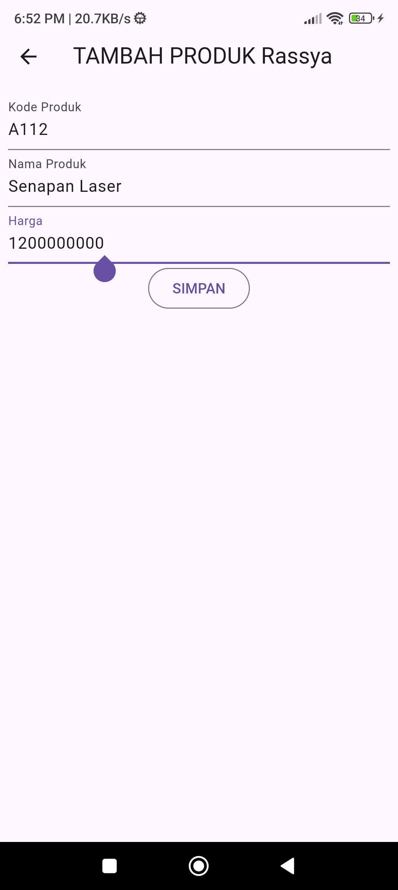
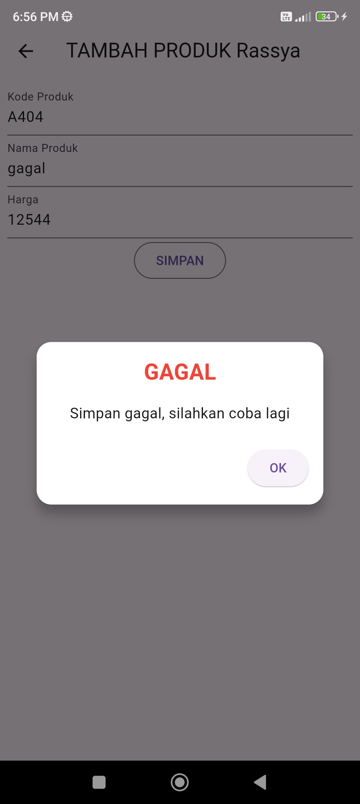


### Detail Produk
1. Detail Produk = produk_page-> produk_detail
Halaman detail produk muncul ketika memencet card pada ProdukPage menampilkan data lengkap dari produk. Widget card pada ProdukPage memiliki value berupa data dari model produk yang berisi data dari suatu produk yang ada di database.
```dart
class ProdukDetail extends StatefulWidget {
  Produk? produk;

  ProdukDetail({Key? key, this.produk}) : super(key: key);
```
```dart
body: Center(
        child: Column(
          children: [
            Text(
              "Kode : ${widget.produk!.kodeProduk}",
              style: const TextStyle(fontSize: 20.0),
            ),
            Text(
              "Nama : ${widget.produk!.namaProduk}",
              style: const TextStyle(fontSize: 18.0),
            ),
            Text(
              "Harga : Rp. ${widget.produk!.hargaProduk.toString()}",
              style: const TextStyle(fontSize: 18.0),
            ),
            _tombolHapusEdit()
          ],
        ),
      ),
```
2. Button Delete =produk_detail -> produk_bloc
Pada DetailProduk terdapat button delete yang mengirimkan data dari produk yang ada di widget ke produk_bloc.dart berupa id dari produk tersebut untuk menghapus data. Method yang dipakai adalah DeleteProduk pada produk_bloc. Pengguna bisa membatalkan aksi dan pengguna akan mendapat pesan WarningDialog bila gagal dilaksanakan.
```dart
// Tombol Hapus
        OutlinedButton(
          child: const Text("DELETE"),
          onPressed: () => confirmHapus(),
        ),
      ],
    );
  }

  void confirmHapus() {
    AlertDialog alertDialog = AlertDialog(
      content: const Text("Yakin ingin menghapus data ini?"),
      actions: [
//tombol hapus
        OutlinedButton(
          child: const Text("Ya"),
          onPressed: () {
            ProdukBloc.deleteProduk(id: int.parse(widget.produk!.id!)).then(
                (value) => {
                      Navigator.of(context).push(MaterialPageRoute(
                          builder: (context) => const ProdukPage()))
                    }, onError: (error) {
              showDialog(
                  context: context,
                  builder: (BuildContext context) => const WarningDialog(
                        description: "Hapus gagal, silahkan coba lagi",
                      ));
            });
          },
        ),
//tombol batal
        OutlinedButton(
          child: const Text("Batal"),
          onPressed: () => Navigator.pop(context),
        )
      ],
    );
    showDialog(builder: (context) => alertDialog, context: context);
  }
}
```

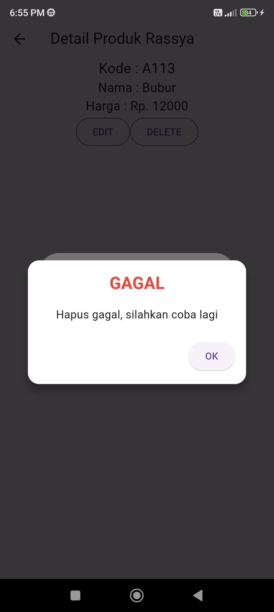

3. Ubah Produk = produk_detail -> produk_form
Pada produk_detail terdapat button ubah untuk melakukan update data ke database. Button tersebut akan mengirimkan data dari model produk yang ada di widget ke page ProdukForm
```dart
// Tombol Edit
        OutlinedButton(
          child: const Text("EDIT"),
          onPressed: () {
            Navigator.push(
              context,
              MaterialPageRoute(
                builder: (context) => ProdukForm(
                  produk: widget.produk!,
                ),
              ),
            );
          },
        ),
```
gambar bisa dilihat pada screenshot Detail Produk

### Ubah Produk = produk_detail -> produk_form-> produk_bloc
Ubah produk merupakan percabangan dari ProdukForm bila widget memiliki data dari model produk sehingga pada TextField sudah terisi nilai sebelumnya untuk dapat diubah.
```dart
isUpdate() {
    if (widget.produk != null) {
      setState(() {
        judul = "UBAH PRODUK Rassya";
        tombolSubmit = "UBAH";
        _kodeProdukTextboxController.text = widget.produk!.kodeProduk!;
        _namaProdukTextboxController.text = widget.produk!.namaProduk!;
        _hargaProdukTextboxController.text = widget.produk!.hargaProduk.toString();
      });
    } else {
      judul = "TAMBAH PRODUK Rassya";
      tombolSubmit = "SIMPAN";
    }
  }
```
ProdukForm memiliki 3 textfield yang dimana semua textfieldnya sudah terisi nilai dari data widget.
```dart
child: Column(
              children: [
                _kodeProdukTextField(),
                _namaProdukTextField(),
                _hargaProdukTextField(),
                _buttonSubmit()
              ],
            ),
```

ProdukForm pada state ubah akan mengeksekusi method ubah bukan simpan pada ProdukForm. Cara kerja method hampir mirip, perbedaannya pada method yang dipanggil di produk_bloc yaitu updateProduk. 
```dart
Widget _buttonSubmit() {
    return OutlinedButton(
        child: Text(tombolSubmit),
        onPressed: () {
          var validate = _formKey.currentState!.validate();
          if (validate) {
            if (!_isLoading) {
              if (widget.produk != null) {
                //kondisi update produk
                ubah();
              } else {
                //kondisi tambah produk
                simpan();
              }
            }
          }
        });
  }

  simpan() {
    setState(() {
      _isLoading = true;
    });
    Produk createProduk = Produk(id: null);
    createProduk.kodeProduk = _kodeProdukTextboxController.text;
    createProduk.namaProduk = _namaProdukTextboxController.text;
    createProduk.hargaProduk = int.parse(_hargaProdukTextboxController.text);
    ProdukBloc.addProduk(produk: createProduk).then((value) {
      Navigator.of(context).push(MaterialPageRoute(
          builder: (BuildContext context) => const ProdukPage()));
    }, onError: (error) {
      showDialog(
          context: context,
          builder: (BuildContext context) => const WarningDialog(
                description: "Simpan gagal, silahkan coba lagi",
              ));
    });
    setState(() {
      _isLoading = false;
    });
  }

  ubah() {
    setState(() {
      _isLoading = true;
    });
    Produk updateProduk = Produk(id: widget.produk!.id!);
    updateProduk.kodeProduk = _kodeProdukTextboxController.text;
    updateProduk.namaProduk = _namaProdukTextboxController.text;
    updateProduk.hargaProduk = int.parse(_hargaProdukTextboxController.text);
    ProdukBloc.updateProduk(produk: updateProduk).then((value) {
      Navigator.of(context).push(MaterialPageRoute(
          builder: (BuildContext context) => const ProdukPage()));
    }, onError: (error) {
      showDialog(
          context: context,
          builder: (BuildContext context) => const WarningDialog(
                description: "Permintaan ubah data gagal, silahkan coba lagi",
              ));
    });
    setState(() {
      _isLoading = false;
    });
  }
}
```

```dart
static Future updateProduk({required Produk produk}) async {
    String apiUrl = ApiUrl.updateProduk(int.parse(produk.id!));
    print(apiUrl);
    var body = {
      "kode_produk": produk.kodeProduk,
      "nama_produk": produk.namaProduk,
      "harga": produk.hargaProduk.toString()
    };
    print("Body : $body");
    var response = await Api().put(apiUrl, jsonEncode(body));
    var jsonObj = json.decode(response.body);
    return jsonObj['status'];
  }
```


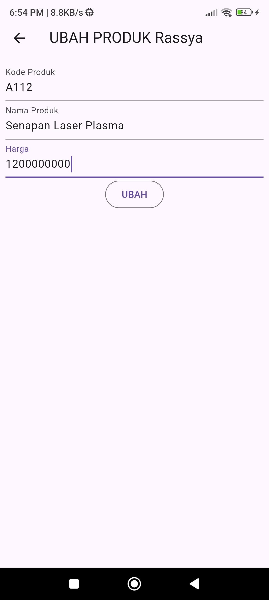


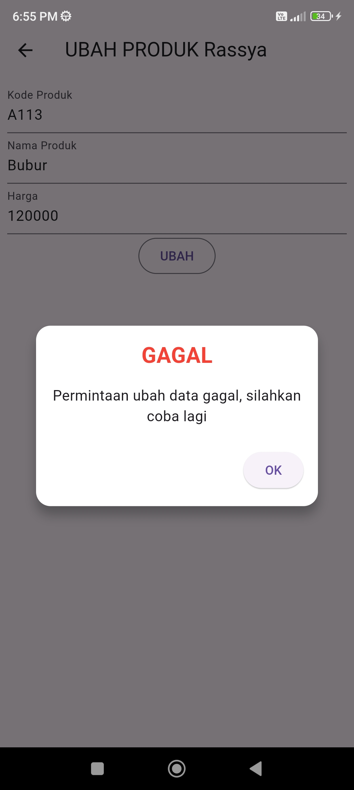