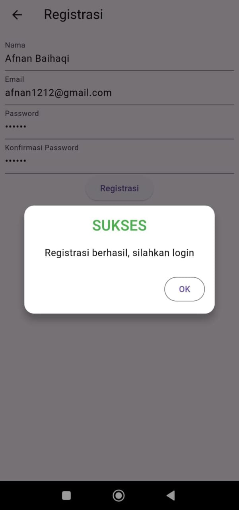
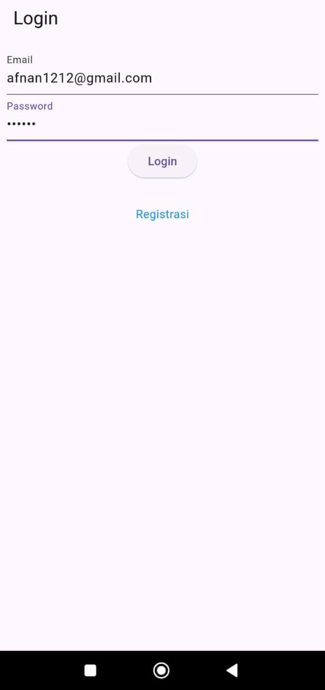
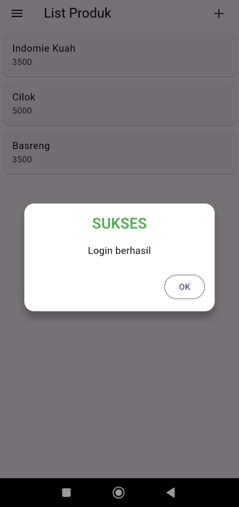
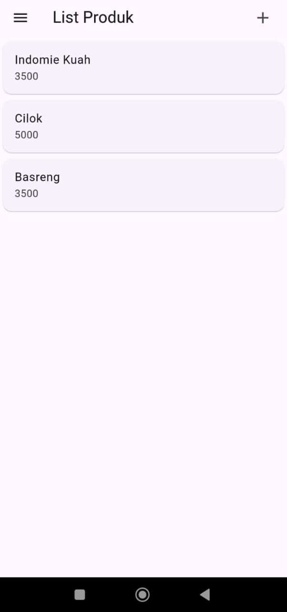
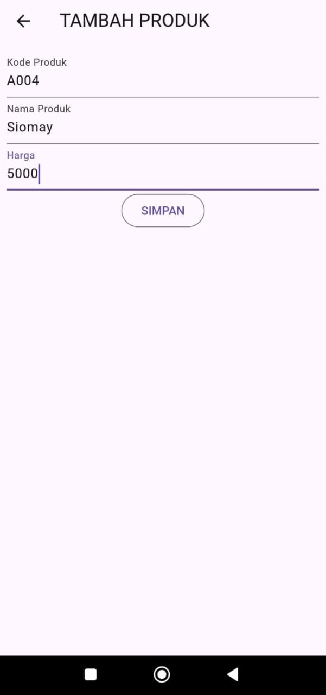
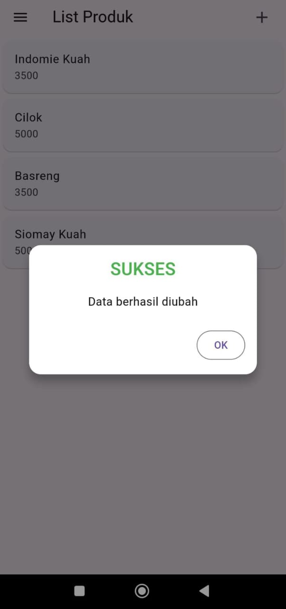
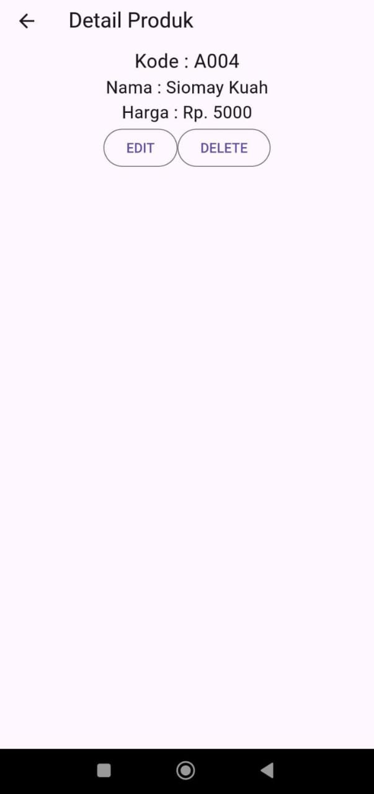
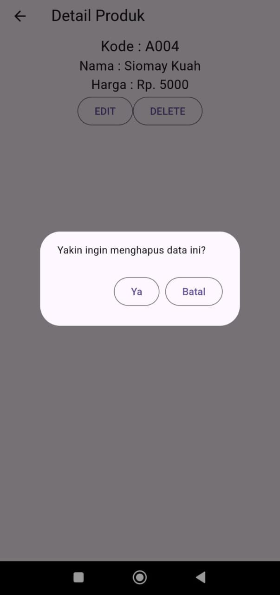
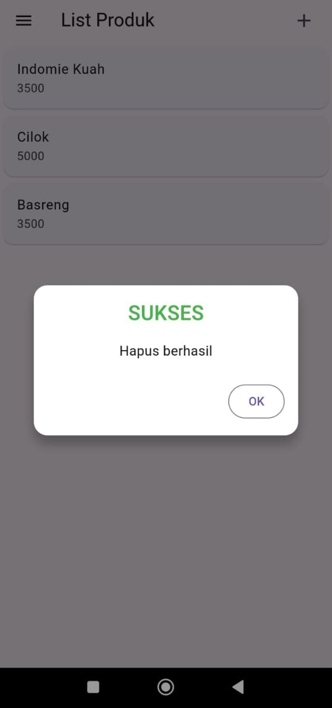
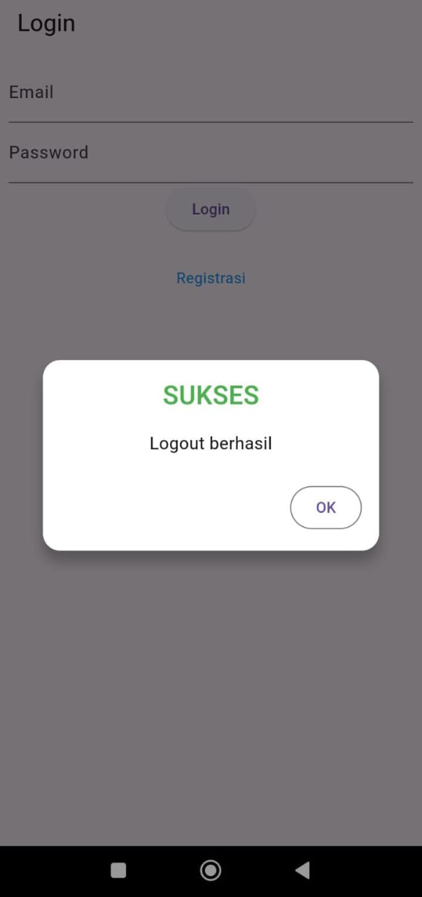

# tokokita

Nama    : M Afnan Baihaqi

NIM     : H1D022080

Shift Baru : B

Shift Lama : A

## Screenshot

### Penjelasan

Registrasi

    Page Registrasi (registrasi_page.dart):
        Terdapat 3 TextEditingController untuk nama, email, dan password.
        Menggunakan Form dengan 4 TextField (termasuk konfirmasi password) dan 1 tombol Registrasi.
        Tombol Registrasi memanggil method _submit() yang melakukan validasi input dan mengirim data ke RegistrasiBloc.registrasi().
    Registrasi Sukses/Gagal:
        Pada tombol Registrasi, jika input valid, fungsi _submit() dipanggil. Data (nama, email, password) dikirim ke registrasi_bloc.dart untuk diteruskan ke server.
        Jika registrasi berhasil, SuccessDialog muncul dengan pesan "Registrasi berhasil, silahkan login".
        Jika registrasi gagal, WarningDialog muncul dengan pesan "Registrasi gagal, silahkan coba lagi".
    Backend Registrasi (registrasi_bloc.dart):
        Data registrasi dikirim ke API dengan endpoint ApiUrl.registrasi.
        API menerima data dalam bentuk JSON (nama, email, password), kemudian menyimpan ke database melalui RESTful API.

Login

    Page Login (login_page.dart):
        Memiliki 2 TextField untuk email dan password, serta 1 tombol Login.
        Pengguna dapat diarahkan ke halaman registrasi menggunakan widget tambahan.

    Login Sukses/Gagal:
        Setelah tombol Login ditekan, input divalidasi dan fungsi _submit() dipanggil.
        Data dari TextField (email, password) dikirim ke LoginBloc.login().
        Jika login berhasil (status code 200), token dan user ID disimpan menggunakan UserInfo dan pengguna diarahkan ke halaman List Produk.
        Jika login gagal, WarningDialog ditampilkan dengan pesan "Login gagal, silahkan coba lagi".

    Backend Login (login_bloc.dart):
        API endpoint ApiUrl.login digunakan untuk mengirim data email dan password.
        Server memeriksa kredensial, dan jika valid, mengembalikan token autentikasi dan data user.

List Produk

    Page Produk (produk_page.dart):
        Menggunakan FutureBuilder untuk mengambil data produk dari server melalui ProdukBloc.getProduks().
        Jika data tersedia, produk ditampilkan dalam ListView berupa Card, yang berisi nama dan harga produk.

    Backend Produk (produk_bloc.dart):
        Fungsi getProduks() mengirim permintaan GET ke endpoint ApiUrl.listProduk.
        Data yang diterima berupa daftar produk, yang kemudian ditampilkan sebagai Card pada halaman List Produk.
        Setiap produk di dalam Card dapat ditekan untuk melihat detail produk.

Tambah Produk

    Page Tambah Produk (produk_form.dart):
        Terdiri atas 3 TextField untuk kode produk, nama produk, dan harga produk.
        Jika tombol Simpan ditekan dan form valid, data dikirim ke backend melalui ProdukBloc.addProduk().
        Tombol Simpan hanya muncul jika form tidak membawa data sebelumnya (kondisi penambahan produk baru).

    Backend Tambah Produk (produk_bloc.dart):
        Metode addProduk() mengirim data produk (kode, nama, harga) ke API dengan endpoint ApiUrl.createProduk.
        Jika berhasil, produk baru disimpan ke database, dan pengguna diarahkan kembali ke halaman List Produk. Jika gagal, muncul WarningDialog.

Ubah Produk

    Page Ubah Produk (produk_form.dart):
        Jika widget produk memiliki data (mengirim produk yang akan diedit), form sudah terisi dengan data produk yang ada.
        Terdiri atas 3 TextField yang sudah diisi dengan kode, nama, dan harga produk yang akan diubah.
        Tombol Ubah digunakan untuk menyimpan perubahan ke server, dan jika valid, method ubah() dipanggil untuk mengirim data ke backend.

    Backend Ubah Produk (produk_bloc.dart):
        Metode updateProduk() mengirim data yang diperbarui ke API dengan endpoint ApiUrl.updateProduk, beserta ID produk.
        Jika berhasil, data produk diperbarui di database dan pengguna diarahkan kembali ke halaman List Produk. Jika gagal, muncul WarningDialog.

Detail Produk

    Page Detail Produk (produk_detail.dart):
        Menampilkan data produk secara detail (kode, nama, dan harga) yang diambil dari widget produk pada halaman List Produk.
        Terdapat tombol Hapus dan Edit untuk menghapus atau mengubah produk.

    Fungsi Hapus Produk:
        Tombol Delete pada Detail Produk memanggil metode ProdukBloc.deleteProduk() dan menampilkan dialog konfirmasi.
        Jika pengguna memilih untuk menghapus, produk dihapus dari database dan pengguna diarahkan kembali ke halaman List Produk.

    Fungsi Ubah Produk:
        Tombol Edit pada Detail Produk mengarahkan pengguna ke halaman ProdukForm dengan data produk yang sudah ada, memungkinkan pengguna untuk memperbarui produk.

Fungsi Backend

    Tambah Produk (addProduk()):
        Mengirim data baru ke API menggunakan metode POST dan menyimpan produk di database.

    Ubah Produk (updateProduk()):
        Mengirim perubahan produk ke API menggunakan metode PUT, dan memperbarui data produk yang ada di database.

    Hapus Produk (deleteProduk()):
        Menghapus produk dari database melalui API dengan metode DELETE.

Kesimpulan:

Aplikasi ini mencakup fitur registrasi, login, serta pengelolaan produk (tambah, ubah, hapus, dan lihat detail). Semua data produk disimpan dan diperbarui melalui RESTful API yang terhubung dengan database, dengan sistem validasi dan notifikasi berupa dialog yang informatif untuk pengguna.
